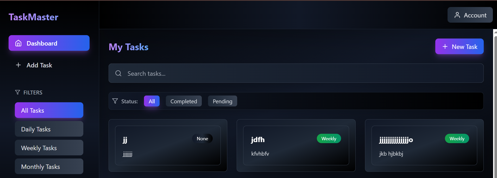
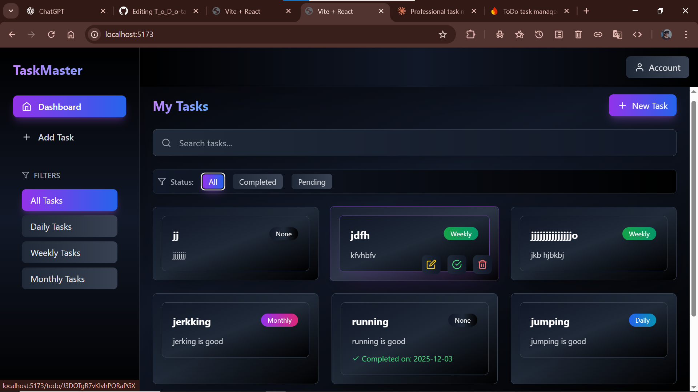
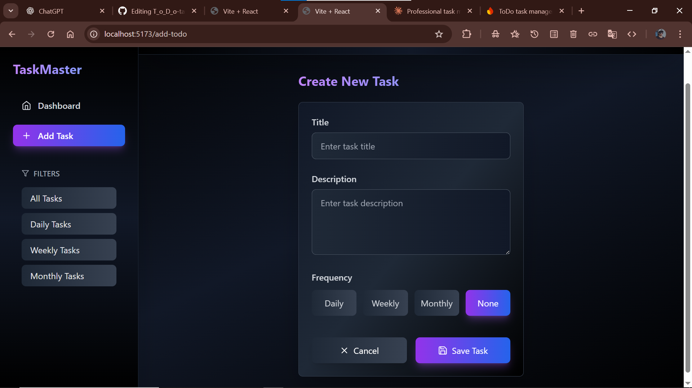

 
# TaskMaster - Professional Task Management System



---
## 🔗 Live Demo

[](https://todo-task-manager-7630b.web.app/)

---

## ⭐ Support the Project!

If you find TaskMaster helpful, please support it by giving a **star ⭐** on GitHub!

[](https://github.com/sayyedrabeeh/T_o_D_o-task-manager-)

---

---

##  Project Overview

**TaskMaster** is a modern, feature-rich task management application designed to help users organize, track, and complete their daily, weekly, and monthly tasks with precision and ease. Built with **React**, **Firebase** and **Tailwind CSS**, and professional UI/UX principles, it provides an intuitive platform for personal productivity.



---

##  Core Purpose & Vision

### Purpose
To provide individuals with a streamlined, visually appealing task management system that goes beyond simple to-do lists by incorporating:
- **Frequency-based tracking** (Daily/Weekly/Monthly)
- **Subtask management** for complex projects
- **Progress visualization** with completion tracking
- **Historical data** to show accountability

### Vision
Empower users to build consistent habits, break down complex goals, and maintain accountability through visual progress tracking and intelligent task organization.

---

##  System Architecture

### Technology Stack

#### **Frontend**
- **React 18**: Component-based architecture for reusable UI elements
- **React Router**: Client-side routing for seamless navigation
- **Lucide React**: Modern icon library for consistent visual language
- **Tailwind CSS**: Utility-first styling with custom gradients
- **date-fns**: Date manipulation and formatting

#### **Backend & Database**
- **Firebase Authentication**: Secure user authentication
- **Firestore Database**: Real-time NoSQL database
- **Firebase Hosting**: Fast, secure content delivery

#### **State Management**
- React Hooks (`useState`, `useEffect`)
- Local component state for UI interactions
- Firebase real-time listeners for data synchronization

---

##  How It Works

### **1. User Authentication Flow**

```text
User Registration (Signup)
    ↓
Email/Password Input → Firebase Auth
    ↓
Create User Profile
    ↓
Initialize Firestore User Document
    ↓
Redirect to Dashboard
````

**Login Process:**

* User enters credentials
* Firebase authenticates
* Retrieve user-specific tasks from Firestore
* Display personalized dashboard

---

### **2. Task Creation & Management**

#### **Creating a Task**

1. User clicks "New Task" button
2. Fills form with:

   * **Title**: Task name
   * **Description**: Detailed explanation
   * **Frequency**: Daily/Weekly/Monthly/None
3. Firebase creates a document in `/users/{uid}/todos/`
4. Task appears in the dashboard with initial tracking checkbox

#### **Task Structure in Database**

```javascript
{
  id: "auto-generated-id",
  title: "Complete Documentation",
  description: "Write detailed project docs",
  frequency: "Daily",
  completed: false,
  tracking: {
    "2025-12-03": false,
    "2025-12-04": true,
  },
  subtasks: [
    {
      id: "subtask-1",
      title: "Research phase",
      frequency: "Daily",
      tracking: { "2025-12-03": false }
    }
  ],
  createdAt: Timestamp
}
```

---

### **3. Progress Tracking System**

#### **Frequency-Based Tracking**

**Daily Tasks:**

* Generate a checkbox for each day from creation to today
* Only the **most recent checkbox** is editable
* Past unchecked boxes show as "missed" (red X)

**Weekly Tasks:**

* Checkbox appears at the start of each week
* Tracks weekly completion

**Monthly Tasks:**

* One checkbox per month
* Tracks monthly completion

**Visual Indicators:**

```
✓ Green Checkmark = Completed
○ Gray Circle = Current (editable)
✗ Red X = Missed
```

---

### **4. Subtask System**

#### **Purpose**

Break down complex tasks into manageable units.

#### **Rules**

* Daily parent → Daily subtasks
* Weekly parent → Daily/Weekly subtasks
* Monthly parent → Daily/Weekly/Monthly subtasks
* None frequency parent → Any frequency subtasks

#### **Progress Calculation**

```javascript
Total Subtasks: 5
Completed Today: 3
Progress: 60% (3/5)
```

Progress bar updates in real-time.

---

### **5. Filtering & Search**

* **Frequency Filters**: All / Daily / Weekly / Monthly
* **Status Filters**: All / Completed / Pending
* **Search**: Real-time Firestore prefix search on task titles/descriptions

---

##  UI/UX Design Principles

### **Visual Design**

* Dark theme with black & gray gradients
* Color accents: Purple/Indigo for actions, Green for completed, Red for missed
* Smooth hover effects and transitions
* Progress bars with animated width changes

### **Typography Hierarchy**

```
H1: 3xl (30px) - Page titles
H2: 2xl (24px) - Section headers
H3: xl (20px) - Card titles
Body: base (16px)
Small: sm (14px)
Tiny: xs (12px)
```

---

##  User Benefits

**Individuals:**

* Habit building with streaks
* Project management via subtasks
* Time management and filtering
* Mental clarity through organized dashboard

 
---

##  Technical Implementation

**Real-Time Updates:**

```javascript
useEffect(() => {
  const unsubscribe = onSnapshot(
    collection(db, "users", uid, "todos"),
    snapshot => {
      setTodos(snapshot.docs.map(doc => ({ id: doc.id, ...doc.data() })));
    }
  );
  return () => unsubscribe();
}, [uid]);
```

**Optimistic UI:**

```javascript
setTodos(prev => prev.map(todo => 
  todo.id === id ? { ...todo, completed: true } : todo
));
await updateDoc(docRef, { completed: true });
```

**Security Rules:**

```javascript
match /users/{userId}/todos/{todoId} {
  allow read, write: if request.auth != null && request.auth.uid == userId;
}
```

---


##  Key Innovations

1. **Editable Latest Checkbox Only**
2. **Frequency-Aware Subtasks**
3. **Missed Task Indicators (Red X)**
4. **Progressive Disclosure of Subtasks**

---

##  Deployment

* Hosted on **Firebase Hosting**
* Firestore for real-time data
* Firebase Auth for secure login

---

##  Quick Reference

**Features:**

* Authentication, Task CRUD, Frequency tracking
* Subtask management
* Progress visualization
* Search & filtering
* Real-time sync
* Responsive UI

**Tech Stack:**

* React 18, Tailwind CSS, Lucide Icons, date-fns
* Firebase (Auth + Firestore)

---


**Transform your productivity with TaskMaster — turning intentions into actions, visually.**


```
 
